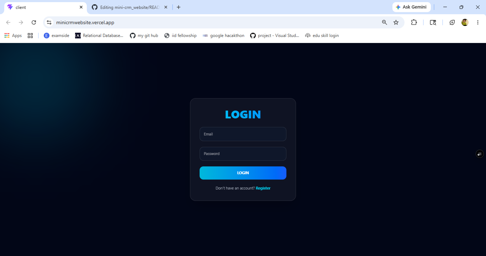
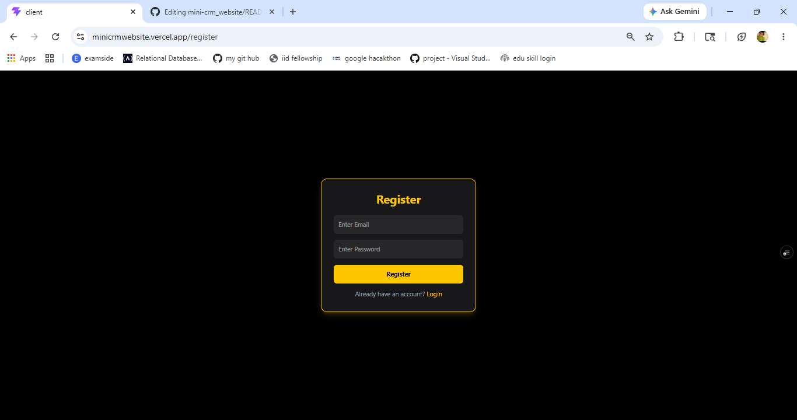
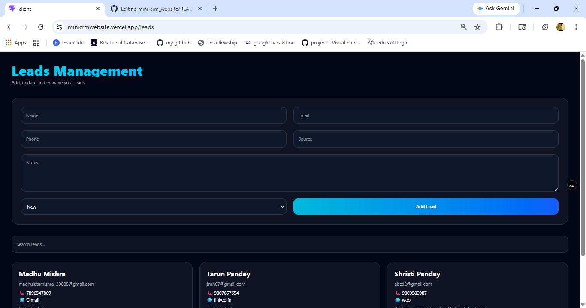
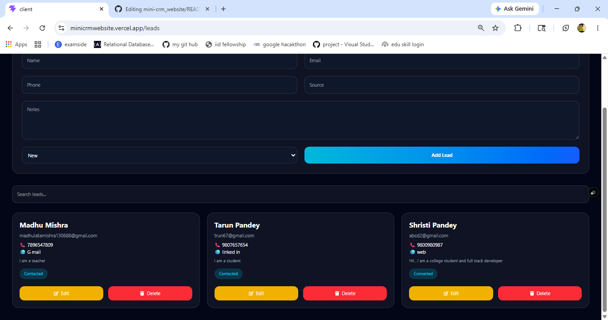
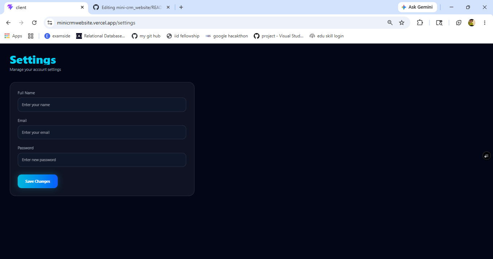

# Mini CRM 🚀

A modern and responsive Full Stack CRM (Customer Relationship Management) web application built using the MERN Stack.  
This project helps users manage leads efficiently with secure authentication, interactive dashboards, and a clean UI experience.
LIVE DEMO: https://minicrmwebsite.vercel.app
---

# 🌟 Features

✅ User Authentication (JWT Based)  
✅ Secure Login & Registration System  
✅ Dynamic User Access  
✅ Lead Management System  
✅ Dashboard with Analytics  
✅ Interactive Charts & Statistics  
✅ Protected Routes  
✅ Responsive Modern UI  
✅ MongoDB Atlas Database Integration  
✅ REST API Integration  
✅ Full Stack Deployment  
✅ Clean Folder Structure  

---

# 🛠️ Tech Stack

## Frontend
- React.js
- Tailwind CSS
- Vite
- Axios
- React Router DOM

## Backend
- Node.js
- Express.js
- MongoDB
- Mongoose
- JWT Authentication
- bcrypt.js

---

# 📂 Project Structure

```bash
mini-crm/
│
├── client/
│   ├── src/
│   ├── components/
│   ├── pages/
│   └── services/
│
├── server/
│   ├── routes/
│   ├── models/
│   ├── middleware/
│   └── server.js
```
---

# 🔐 Authentication Features

- User Registration
- Secure Password Hashing
- JWT Token Authentication
- Protected Dashboard Access
- Persistent Login using Local Storage

---

## 📊 Dashboard Features

- Lead Tracking
- Analytics Overview
- Modern UI Cards
- Chart Visualizations
- CRM Workflow Interface

---

## 🌐 Deployment

### Frontend Deployment
Deployed using **Vercel**

### Backend Deployment
Deployed using **Render**

---

## 📸 Screenshots

### 🔑 Login Page


---

### 📝 Register Page


---

### 📊 Dashboard


---

### 📋 Leads Section


---

### 📈 Lead Management


---

### ⚙️ Settings Page



---

## ⚡ Getting Started

### Clone the Repository

```bash
git clone https://github.com/your-username/mini-crm.git
```

---

### Install Dependencies

Frontend
cd client
npm install
npm run dev
Backend
cd server
npm install
npm start

---

### 🔑 Environment Variables

Create a .env file inside the server folder and add:

MONGO_URI=your_mongodb_connection
JWT_SECRET=your_secret_key

---

# 👨‍💻 Author

Developed with ❤️ by Shristi Pandey

---

# ⭐ Future Improvements
Edit & Delete Leads
User-specific Dashboard
Notifications System
Role-based Authentication
Email Integration
Advanced Analytics
│
└── README.md
